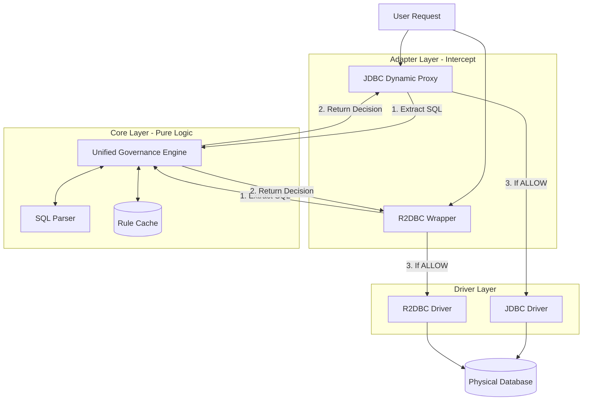

# Enterprise Dynamic Proxy

A Database Governance & Observability Platform that provides transparent SQL query interception and validation for both synchronous (JDBC) and reactive (R2DBC) database drivers.

## Overview

This project implements a governance layer that intercepts database operations and applies safety rules before executing queries. It uses:

- **Opinionated by Design**: Enforces database safety standards via configuration only
- **Adapter Pattern** for JDBC (using Dynamic Proxy)
- **Decorator Pattern** for R2DBC (using Wrapper classes)
- **Onion Architecture** to separate business logic from driver technologies

> 💡 **Philosophy**: This library is intentionally opinionated. Consumers only add the dependency and configure via YAML - no custom code required. See [Library Philosophy](docs/philosophy.md) for details.

## Architecture

The system consists of three main layers:



### 1. Core Layer (Pure Logic)
- **GovernanceEngine**: Interface for implementing governance rules
- **SimpleRuleEngine**: Default implementation with basic safety rules
- **GovernanceDecision**: Value object representing allow/block/warn decisions
- **SQLParser**: Interface for parsing SQL queries into structured information
- **BasicSQLParser**: Regex-based SQL parser implementation
- **RuleCache**: Interface for caching governance decisions
- **InMemoryRuleCache**: LRU cache implementation for performance optimization

### 2. JDBC Adapter (Synchronous)
- Uses Java's Dynamic Proxy (`java.lang.reflect.Proxy`)
- Automatically intercepts JDBC method calls
- Transparent integration with existing JDBC code

### 3. R2DBC Adapter (Reactive)
- Uses Decorator/Wrapper pattern
- Maintains Fluent API contract
- Fully non-blocking and reactive

## Documentation

📚 **[Complete Documentation](docs/README.md)**

- [Getting Started Guide](docs/getting-started.md) - Installation and basic usage
- [Spring Boot Integration](docs/spring-boot-integration.md) - Zero-configuration setup with Spring Boot
- [Configuration Reference](docs/configuration-reference.md) - All configuration options
- [Architecture Overview](docs/architecture.md) - Design patterns and architecture
- [Advanced Usage](docs/advanced-usage.md) - Custom rules and advanced topics
- [API Reference](docs/api-reference.md) - Complete API documentation
- [Risk & Limitations Analysis](docs/risk-and-limitations.md) - Enterprise adoption considerations

## Features

### Spring Boot Auto-Configuration
Zero-configuration integration with Spring Boot 3.2+:
- Automatically wraps your `DataSource` (JDBC) or `ConnectionFactory` (R2DBC)
- Configurable via `application.yml` properties
- Enable/disable with `enterprise.governance.enabled=true/false`

### SQL Parser
The `BasicSQLParser` analyzes SQL queries to extract:
- SQL statement type (SELECT, INSERT, UPDATE, DELETE, DROP, etc.)
- Table names
- Presence of WHERE clauses
- Use of SELECT *

### Rule Cache
The `InMemoryRuleCache` provides performance optimization through:
- LRU (Least Recently Used) eviction strategy
- Configurable cache size (default: 1000 entries)
- SQL normalization for better cache hit rates
- Thread-safe concurrent access

### Safety Rules

The default `SimpleRuleEngine` implements the following safety rules:

1. **Block DELETE/UPDATE without WHERE clause**: Prevents accidental mass deletion or updates
2. **Block schema modifications**: Prevents `DROP TABLE`, `TRUNCATE`, `ALTER TABLE`
3. **Warn on SELECT ***: Alerts on potentially inefficient queries

## Quick Start

### Spring Boot (Recommended)

Add the dependency:
```gradle
dependencies {
    implementation 'com.enterprise:enterprise-dynamic-proxy:1.0.0-SNAPSHOT'
}
```

Configure in `application.yml`:
```yaml
enterprise:
  governance:
    enabled: true
    block-unsafe-deletes: true
    block-schema-changes: true
```

That's it! Your DataSource/ConnectionFactory is automatically governed.

See [Spring Boot Integration Guide](docs/spring-boot-integration.md) for more details.

### Programmatic Usage

#### JDBC Example

```java
import com.enterprise.governance.core.SimpleRuleEngine;
import com.enterprise.governance.jdbc.JdbcGovernance;
import javax.sql.DataSource;

// Wrap your existing DataSource
GovernanceEngine engine = new SimpleRuleEngine();
DataSource originalDataSource = // ... your DataSource
DataSource governedDataSource = JdbcGovernance.wrapDataSource(originalDataSource, engine);

// Use the governed DataSource normally
try (Connection conn = governedDataSource.getConnection();
     Statement stmt = conn.createStatement()) {
    
    // This will execute normally
    stmt.executeQuery("SELECT id, name FROM users WHERE id = 1");
    
    // This will throw SQLException with governance message
    stmt.execute("DELETE FROM users"); // Blocked: Missing WHERE clause
}
```

### R2DBC Example

```java
import com.enterprise.governance.core.SimpleRuleEngine;
import com.enterprise.governance.r2dbc.GovConnectionFactory;
import io.r2dbc.spi.ConnectionFactory;

// Wrap your existing ConnectionFactory
GovernanceEngine engine = new SimpleRuleEngine();
ConnectionFactory originalFactory = // ... your ConnectionFactory
ConnectionFactory governedFactory = new GovConnectionFactory(originalFactory, engine);

// Use the governed ConnectionFactory normally
Mono.from(governedFactory.create())
    .flatMapMany(connection ->
        Flux.from(connection.createStatement("SELECT * FROM users WHERE id = $1")
                .bind(0, 1)
                .execute())
            .flatMap(result -> /* process result */)
            .doFinally(signal -> Mono.from(connection.close()).subscribe())
    )
    .subscribe();
```

## Governance Rules

The library enforces these industry-standard safety rules:

1. **Block DELETE/UPDATE without WHERE clause** - Prevents accidental mass deletion
2. **Block schema modifications** - Prevents `DROP`, `TRUNCATE`, `ALTER` operations  
3. **Warn on SELECT \*** - Alerts on potentially inefficient queries

All rules are configurable via properties - **no custom code required**:

```yaml
enterprise:
  governance:
    block-unsafe-deletes: true      # Enforce WHERE clause
    block-schema-changes: true      # Block DDL operations
    warn-select-all: true           # Warn on SELECT *
```

## Building

```bash
./gradlew build
```

## Testing

```bash
./gradlew test
```

Run specific test classes:
```bash
./gradlew test --tests "com.enterprise.governance.core.*"
```

Test coverage includes:
- Core governance engine rules
- JDBC proxy interception
- R2DBC wrapper interception
- Both allow and block scenarios

## Dependencies

- Java 21 or higher
- R2DBC SPI 1.0.0.RELEASE
- Reactor Core 3.5.0
- JUnit 5 for testing

## License

This project is provided as-is for educational and demonstration purposes.

## Design Principles

1. **Separation of Concerns**: Business logic is completely independent of driver technologies
2. **Non-Invasive**: Works transparently with existing code
3. **Type-Safe**: Leverages compile-time checking
4. **Reactive-Ready**: Full support for reactive programming with R2DBC
5. **Extensible**: Easy to add custom rules and logic

## What's Included

✅ **SQL Parser**: Extract table names, SQL types, WHERE clauses  
✅ **Rule Cache**: LRU cache for performance optimization  
✅ **JDBC Support**: Dynamic Proxy for synchronous databases  
✅ **R2DBC Support**: Decorator Pattern for reactive databases  
✅ **Spring Boot**: Auto-configuration for zero-config setup  
✅ **Comprehensive Tests**: 46 passing tests (14 parser + 9 cache + 11 engine + 7 JDBC + 5 R2DBC)  

## Future Enhancements

Potential areas for extension:
- Advanced SQL parsing with ANTLR or JSqlParser
- Metrics and observability integration (Micrometer)
- Distributed cache support (Redis)
- Dynamic rule loading from database
- Integration with external policy engines
- Query performance monitoring
- Audit logging capabilities
