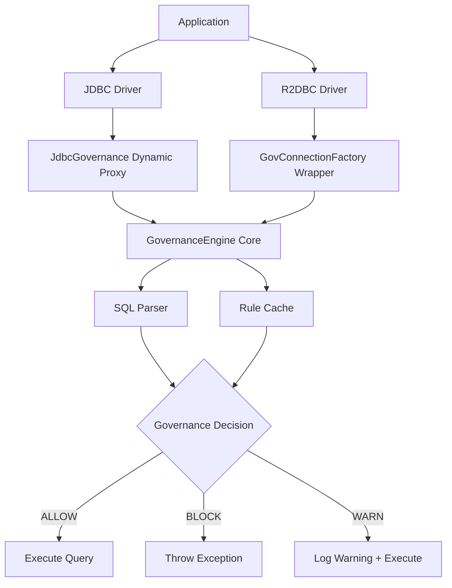

# Architecture

This document describes the architecture and design patterns used in the Enterprise Dynamic Proxy.

## Architectural Overview

The system follows **Onion Architecture** (also known as Clean Architecture) principles:

```
┌─────────────────────────────────────────┐
│         Driver Layer (External)         │
│  JDBC Drivers, R2DBC Drivers, Spring    │
└─────────────────────────────────────────┘
                    ↓
┌─────────────────────────────────────────┐
│         Adapter Layer (Wrappers)        │
│  JdbcGovernance, GovConnectionFactory   │
└─────────────────────────────────────────┘
                    ↓
┌─────────────────────────────────────────┐
│       Core Layer (Business Logic)       │
│  GovernanceEngine, SQLParser, Cache     │
└─────────────────────────────────────────┘
```

### Key Principles

1. **Dependency Rule**: Dependencies point inward (Core has no dependencies)
2. **Adapter Pattern**: Isolate technology-specific code
3. **Interface Segregation**: Small, focused interfaces
4. **Dependency Inversion**: Depend on abstractions, not concrete implementations

## Architecture Diagram



## Core Layer

The core layer contains business logic and has no external dependencies.

### Components

#### 1. GovernanceEngine

**Purpose**: Interface defining governance behavior

```java
public interface GovernanceEngine {
    GovernanceDecision inspect(String sql);
}
```

**Implementation**: `SimpleRuleEngine`
- Evaluates SQL against governance rules
- Uses SQLParser for SQL analysis
- Uses RuleCache for performance

#### 2. GovernanceDecision

**Purpose**: Value object representing governance outcome

```java
public enum GovernanceDecision {
    ALLOW,      // SQL is safe, execute normally
    BLOCK,      // SQL is dangerous, throw exception
    WARN        // SQL is suboptimal, log warning
}
```

#### 3. SQLParser

**Purpose**: Interface for SQL parsing and analysis

```java
public interface SQLParser {
    Set<String> extractTableNames(String sql);
    String getSqlType(String sql);
    boolean hasWhereClause(String sql);
}
```

**Implementation**: `BasicSQLParser`
- Regex-based parsing
- Handles common SQL patterns
- Thread-safe

#### 4. RuleCache

**Purpose**: Interface for caching governance decisions

```java
public interface RuleCache {
    GovernanceDecision get(String sql);
    void put(String sql, GovernanceDecision decision);
    void clear();
}
```

**Implementation**: `InMemoryRuleCache`
- LRU eviction policy
- Thread-safe with synchronized methods
- SQL normalization (uppercase + trim)

## Adapter Layer

The adapter layer connects the core to specific database technologies.

### JDBC Adapter

**Pattern**: Dynamic Proxy Pattern

**Key Class**: `JdbcGovernance`

```java
public class JdbcGovernance {
    public static DataSource wrapDataSource(
            DataSource original, 
            GovernanceEngine engine) {
        // Create dynamic proxy for DataSource
        return (DataSource) Proxy.newProxyInstance(...);
    }
}
```

**Flow**:
1. Application calls `dataSource.getConnection()`
2. Proxy intercepts and wraps Connection
3. Application calls `connection.createStatement()`
4. Proxy intercepts and wraps Statement
5. Application calls `statement.execute(sql)`
6. Proxy checks governance, then delegates to real Statement

**Advantages**:
- Zero code changes required
- Works with any JDBC-compliant driver
- Minimal performance overhead

### R2DBC Adapter

**Pattern**: Decorator Pattern

**Key Classes**:
- `GovConnectionFactory`: Wraps ConnectionFactory
- `GovConnection`: Wraps Connection
- `GovStatement`: Wraps Statement

```java
public class GovConnectionFactory implements ConnectionFactory {
    private final ConnectionFactory delegate;
    private final GovernanceEngine engine;
    
    @Override
    public Publisher<? extends Connection> create() {
        return Mono.from(delegate.create())
            .map(conn -> new GovConnection(conn, engine));
    }
}
```

**Flow**:
1. Application calls `connectionFactory.create()`
2. GovConnectionFactory wraps returned Connection
3. Application calls `connection.createStatement(sql)`
4. GovConnection wraps returned Statement
5. Application calls `statement.execute()`
6. GovStatement checks governance, then delegates

**Advantages**:
- Maintains reactive semantics
- Non-blocking governance checks
- Compatible with Project Reactor

## Design Patterns

### 1. Dynamic Proxy (JDBC)

**Intent**: Add behavior to objects without modifying their code

**Participants**:
- `InvocationHandler`: Governance logic
- `Proxy`: Generated at runtime
- `DataSource/Connection/Statement`: Target interfaces

**Benefits**:
- Transparent wrapping
- No inheritance needed
- Works with any implementation

### 2. Decorator (R2DBC)

**Intent**: Add behavior by wrapping objects

**Participants**:
- `GovConnectionFactory`: Decorator for ConnectionFactory
- `GovConnection`: Decorator for Connection
- `GovStatement`: Decorator for Statement

**Benefits**:
- Explicit wrapping
- Maintains type safety
- Clear delegation chain

### 3. Strategy (Governance)

**Intent**: Define interchangeable algorithms

**Participants**:
- `GovernanceEngine`: Strategy interface
- `SimpleRuleEngine`: Concrete strategy
- Adapter Layer: Context using strategy

**Benefits**:
- Easy to add new rule engines
- Core logic decoupled from rules
- Testable in isolation

### 4. Adapter

**Intent**: Convert interface of a class into expected interface

**Participants**:
- JDBC/R2DBC: Third-party interfaces
- JdbcGovernance/GovConnectionFactory: Adapters
- Core: Target interface

**Benefits**:
- Core independent of database technology
- Easy to support new technologies
- Single Responsibility Principle

## Data Flow

### JDBC Query Execution

```
Application
    ↓
dataSource.getConnection()
    ↓
[Dynamic Proxy intercepts]
    ↓
connection.createStatement()
    ↓
[Dynamic Proxy intercepts]
    ↓
statement.execute("DELETE FROM users")
    ↓
[Dynamic Proxy intercepts]
    ↓
engine.inspect("DELETE FROM users")
    ↓
[Check cache]
    ↓
[Parse SQL]
    ↓
[Evaluate rules]
    ↓
BLOCK (no WHERE clause)
    ↓
[Throw SQLException]
```

### R2DBC Query Execution

```
Application
    ↓
connectionFactory.create()
    ↓
[Returns Mono<GovConnection>]
    ↓
connection.createStatement("SELECT * FROM users")
    ↓
[Returns GovStatement]
    ↓
statement.execute()
    ↓
[GovStatement intercepts]
    ↓
engine.inspect("SELECT * FROM users")
    ↓
WARN (SELECT *)
    ↓
[Log warning]
    ↓
[Delegate to real statement]
```

## Extensibility

### Custom Cache Implementation

The governance rules are fixed, but you can customize the caching layer:

```java
@Configuration
public class CacheConfig {
    
    @Bean
    public RuleCache redisRuleCache(RedisTemplate<String, String> redis) {
        return new RedisRuleCache(redis);
    }
}
```

### Custom SQL Parser

```java
public class AdvancedSQLParser implements SQLParser {
    
    @Override
    public Set<String> extractTableNames(String sql) {
        // Use ANTLR, JSqlParser, or other advanced parser
        return /* parsed tables */;
    }
}
```

### Custom Cache Implementation

```java
public class RedisRuleCache implements RuleCache {
    
    private final RedisTemplate<String, GovernanceDecision> redis;
    
    @Override
    public GovernanceDecision get(String sql) {
        return redis.opsForValue().get(normalize(sql));
    }
    
    @Override
    public void put(String sql, GovernanceDecision decision) {
        redis.opsForValue().set(normalize(sql), decision, 1, TimeUnit.HOURS);
    }
}
```

## Testing Strategy

### Unit Tests

- Core layer: Test business logic in isolation
- Mock SQLParser and RuleCache
- Verify governance decisions

### Integration Tests

- JDBC adapter: Test with real database
- R2DBC adapter: Test reactive flows
- Verify exception handling

### Spring Boot Tests

- Auto-configuration: Verify beans created
- Property binding: Test configuration
- End-to-end: Full Spring Boot application

## Performance Considerations

### Cache Hit Rate

- High cache hit rate reduces parsing overhead
- Monitor cache effectiveness
- Tune cache size based on query diversity

### Proxy Overhead

- Dynamic proxy adds minimal overhead (~1-2µs)
- Decorator adds minimal overhead (~0.5µs)
- Parsing overhead depends on SQL complexity

### Memory Usage

- InMemoryRuleCache: O(cache-size) memory
- BasicSQLParser: Stateless, minimal memory
- JDBC proxies: One proxy per Connection/Statement

## Security Considerations

- SQL injection prevention through governance rules
- No SQL execution in governance layer
- Read-only SQL parsing
- Thread-safe implementations

## Next Steps

- Review [API reference](api-reference.md)
- Implement [custom rules](advanced-usage.md#custom-rules)
- Explore [Spring Boot integration](spring-boot-integration.md)
